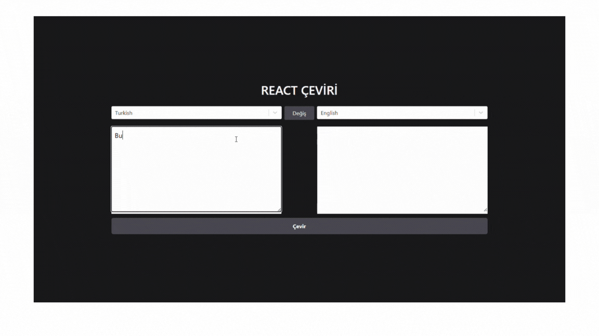

# REDUX-TOOLKIT-THUNK-TRANSLATE-WORK

<h4>

🌍 Dil Çeviri Uygulaması (React + Redux Toolkit)
📌 Proje Özeti:
Bu proje, kullanıcıların bir metni seçtikleri diller arasında çevirmelerine olanak tanıyan bir dil çeviri uygulamasıdır. Uygulama modern frontend teknolojileri kullanılarak geliştirilmiştir.

🚀 Kullanılan Teknolojiler:
React.js – Bileşen tabanlı arayüz geliştirme

Redux Toolkit – Global state yönetimi

Redux Thunk / createAsyncThunk – API işlemleri için async yapılar

JavaScript (ES6+)

Dil Çeviri API’si – (Varsa, API adını yazabilirsin)

🧠 Özellikler:
🌐 Dil Seçimi: Kaynak ve hedef dili kullanıcı belirleyebilir.

🔁 Dilleri Değiştir: Bir buton ile kaynak ve hedef dilleri yer değiştir.

✏️ Metin Girişi: Kullanıcının çevirmek istediği metni yazabildiği input alanı.

🔄 Gerçek Zamanlı Çeviri: Kullanıcı yazdıkça çeviri işlemi tetiklenir.

🔥 Yükleniyor Durumu: Çeviri esnasında kullanıcıya isLoading durumu gösterilir.

🐞 Hata Yönetimi: API isteklerinde hata oluşursa kullanıcı bilgilendirilir.

🧪 Redux DevTools ile izlenebilir yapı

</h4>

<h5>Gif Dökümanı : </h5>

